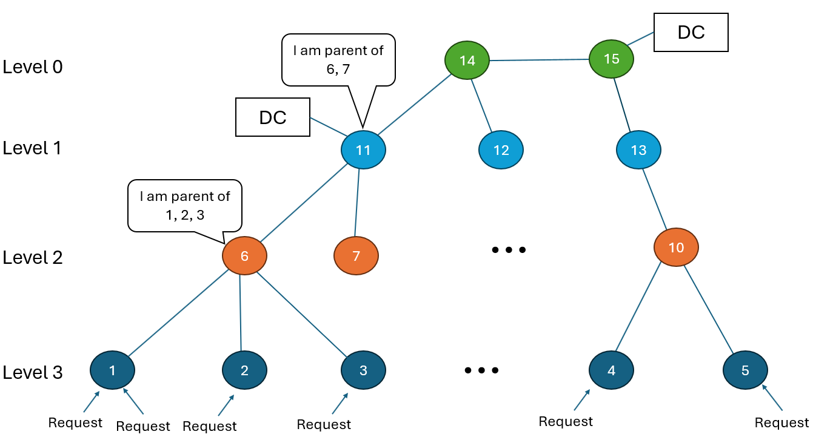

# Serverless Simulator Strategies Documentation

This document outlines the various strategies implemented in the serverless simulator for datacenter placement, request routing, resource allocation, and container lifecycle management. Each strategy addresses different aspects of the system and can be configured to study various deployment scenarios.

## 1. Edge and Cloud Datacenter Placement Strategies (`Topology.py`)

The simulator supports multiple strategies for placing datacenters within the network topology. These strategies determine both the number and location of datacenters.

### 1.1 Cluster Strategy Types (modify with variables.CLUSTER_STRATEGY)

- **`centralized_cloud`**: Single cloud datacenter handles all requests
- **`distributed_cloud`**: Multiple cloud datacenters distributed across the topology  
- **`massive_edge`**: Only edge datacenters, no cloud infrastructure
- **`massive_edge_cloud`**: Hybrid approach with both edge and cloud datacenters

### 1.2 Datacenter Quantity and Location

**Cloud Datacenters:**
- Currently limited to one cloud DC positioned at a predefined layer-0 switch (core switch)
- Location specified by `variables.CENTRAL_CLOUD_NODE`
- Can be configured with unlimited server capacity for baseline comparisons

**Edge Datacenters:**
- Number determined by network topology level specified in `variables.EDGE_DC_LEVEL`
- If `EDGE_DC_LEVEL = 1`: Edge DCs placed at all layer-1 switches (typically ~50 locations)
- If `EDGE_DC_LEVEL = 2`: Edge DCs placed at all layer-2 switches (typically ~200+ locations)
- Each qualifying switch hosts exactly one edge DC

### 1.3 Server Distribution Strategies (modify with variables.EDGE_SERVER_PROVISION_STRATEGY)

Two strategies distribute a fixed total number of edge servers (`variables.EDGE_SERVER_NUMBER`) across edge datacenters:

- **`equally`**: Distributes servers evenly across all edge DCs, with remainder servers allocated to first few DCs
- **`population_weighted`**: Distributes servers proportionally based on the population served by each network node, allowing for realistic resource allocation that matches demand density

## 2. Request Routing and Cluster Selection Strategies (`Topology.py`)


### 2.1 Clustering Strategies

The strategy for determining which clusters are available to handle a request depends on `variables.CLUSTER_STRATEGY`. The following clustering strategies are defined in the constructor of Topology.py.

- **`centralized_cloud`**: All requests routed to the single cloud DC
- **(deprecated) `distributed_cloud`**: Requests can be routed to multiple cloud DCs, sorted by network latency
- **`massive_edge`**: Requests routed only to the nearest edge DC based on network hierarchy
- **`massive_edge_cloud`**: Requests can choose between nearest edge DC and cloud DC

### 2.2 Request routing (`Topology.py/find_hierarchical_path()`)

Request routing between network nodes utilizes the `find_hierarchical_path()` function, which navigates the hierarchical topology structure by comparing node levels and routing accordingly. The function implements upward or downward path traversal through the network's tree-like architecture, as illustrated in the hierarchical network diagram below.



Typically, requests originate from level-3 nodes (Ingress points) and target higher-level nodes where datacenters are located. The routing algorithm operates as follows:

1. **Level Comparison**: Compare the levels of source node A and destination node B
2. **Upward Traversal**: If A's level differs from B's level, route A to its parent node
3. **Iterative Process**: Continue comparing A's parent level with B's level
4. **Convergence**: Repeat until reaching B's hierarchical level

## 3. Load Balancing Strategies (`LoadBalancer.py`)


### 3.1 Cluster Selection Strategy (cluster_selection_strategy)

Currently implements **"edge_first"** strategy:
- Prioritizes edge clusters for latency-sensitive applications
- Falls back to cloud clusters when edge resources unavailable
- Random selection as final fallback

### 3.2 Request Handling Strategy (request_handling_strategy)

Currently implements **"greedy"** strategy:
- Tries clusters in order of proximity/preference
- Attempts idle container reuse first
- Falls back to new container spawning if needed
- Moves to next cluster if current cluster lacks resources

### 3.3 Container Selection Strategy (container_selection_strategy)

Currently implements **"random"** strategy:
- Randomly selects from available idle containers
- Simple approach that avoids container favoritism

**Future Enhancement Opportunities:**
- **Latency-aware**: Consider network delay when choosing between clusters
- **Load-balanced**: Balance requests across clusters based on current utilization
- **Application-aware**: Route based on application-specific requirements
- **Cost-optimized**: Consider energy or monetary costs in routing decisions

## 4. Container Scheduling Strategies (`Scheduler.py`)

### 4.1 Available Scheduling Algorithms

**FirstFitScheduler (Default):**
- Places containers on first server with sufficient resources
- Fast placement decisions with minimal computation
- Can lead to resource fragmentation

**BestFitScheduler:**
- Places containers on server with least remaining capacity that can accommodate request
- Aims to consolidate workloads and minimize fragmentation
- Higher computation overhead but better resource utilization

### 4.2 Scheduler Configuration

Scheduling strategy is set during System initialization:
```python
scheduler_class = FirstFitScheduler  # or BestFitScheduler
system = System(env, topology, scheduler_class=scheduler_class)
```

**Future Enhancement Opportunities:**
- Per-cluster scheduler configuration
- **Worst-fit**: Spread load evenly across servers
- **Load-aware**: Consider current server utilization
- **Affinity-based**: Co-locate related containers
- **Anti-affinity**: Separate competing workloads

## 5. Container Lifecycle and Idle Timeout Strategies (`Scheduler.py`, `System.py`)

### 5.1 Current Idle Timeout Strategy

**Universal Timeout (Default):**
- All applications use same static timeout value (`variables.UNIVERSAL_TIMEOUT`)
- Simple approach suitable for baseline studies
- Applied uniformly across all clusters

### 5.2 Timeout Distribution

**FirstFitScheduler:** Uses exponential distribution with fixed mean
**BestFitScheduler:** Uses dynamic timeout based on system load:
- Shorter timeouts under high load to free resources quickly
- Longer timeouts under low load to improve container reuse
- Maintains minimum threshold to prevent excessive churn

### 5.3 Future Enhancement Opportunities

**Application-Specific Timeouts:**
- Different timeout values per application type
- Based on historical usage patterns or SLA requirements
- Similar to Kubernetes `autoscaling.knative.dev/scale-down-delay`

**Adaptive Timeout Strategies:**
- **Load-based**: Adjust timeouts based on cluster utilization
- **Time-of-day**: Vary timeouts based on expected demand patterns  
- **Cost-aware**: Balance container reuse against energy costs
- **SLA-driven**: Optimize timeouts to meet performance requirements

## 6. Network Model Strategies (`Topology.py`)

### 6.1 Bandwidth Reservation Model
- Reserves exact bandwidth for request duration
- Rejects requests when insufficient bandwidth available
- Provides deterministic performance guarantees

### 6.2 Packet Switching Model  
- Models shared bandwidth with flow counting
- Calculates transmission delays based on active flows
- More realistic representation of network behavior

## Summary

The simulator provides a comprehensive framework for studying various deployment and management strategies in edge-cloud computing environments. Current implementations provide solid baselines, while the modular design allows for easy extension and experimentation with new strategies. Each strategy component can be independently modified to study specific aspects of system behavior while maintaining compatibility with other components. 


